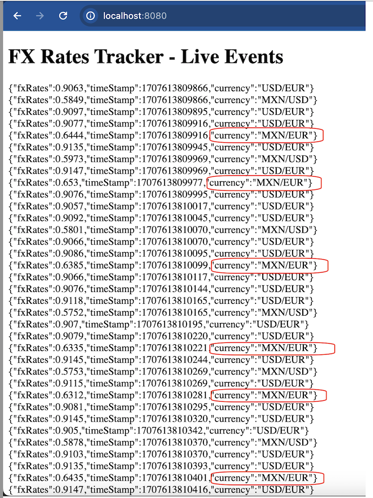

# FX Market Rate - Dynamic Computation & Uni Direction Streaming

FX Rates for currency pair of MXN/USD and USD/EUR are dynamically generated within a given range over a specific interval. The system carefully stores the ticks generated and an a fixed time delay, based on the last ticks generated for the given currency, a logic is put in place to determine the FX Rates for the currency MXN/EUR. This is dynamically done and the time delay it hold is different from those for the predefined currency set.

In this approach, I have used Server-Side Events workflow to orchestrate the continuous streaming of the live event of this dynamic computation without any delay and to the precision value. This is uni-directional architecture and this way of communication will be much efficient.

Testing is covered for the context loadings and Currency Structures. More Testing can be added inline to the services orchestration and workflow.

## Installation

The project is built such a way that the UI is embedded into index.html with Javascript framework capturing the logic to ingest the generated event dynamically and attach to the DOM. By this, as a developer it would be quick to clone the project, run with embedded tomcat in your local machine and just navigate to the http://localhost:8080 - where streaming is real time and as per the delay planned for the currency set.

To Run Tests:

```bash
mvn clean test
```

To Run Locally:

```bash
mvn spring-boot:run
```

To Package:

```bash
mvn clean package
```

## Sample Screenshot of the Quick View of the Event Streaming:


